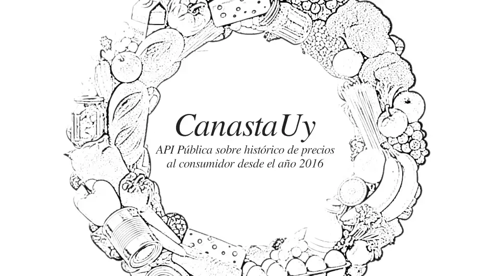
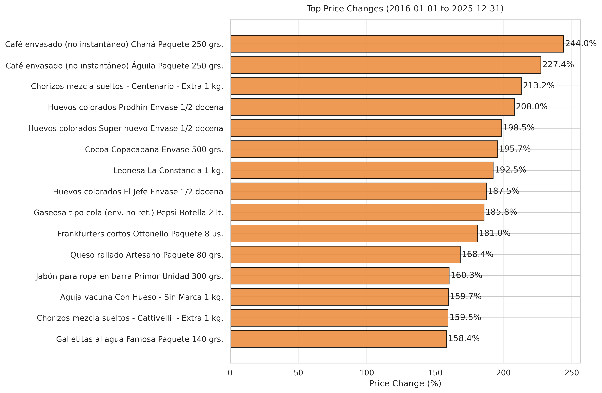
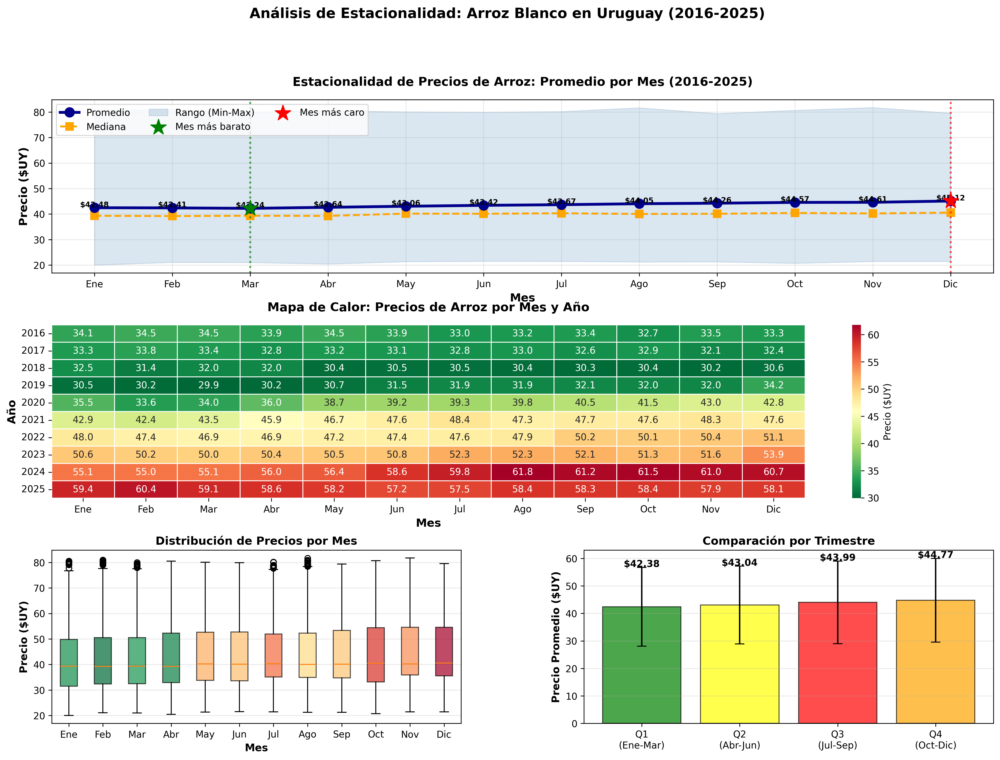

# CanastaUY



API REST para consulta y análisis histórico de precios de productos al consumidor en Uruguay. El proyecto recopila datos desde 2016 hasta 2025, procesándolos mediante técnicas de detección de outliers para garantizar la calidad de la información.

El objetivo es proporcionar una fuente de datos confiable para análisis de tendencias de precios, comparativas entre productos, y métricas de inflación por categoría. La API permite acceder a más de 774 mil registros de precios diarios mediante endpoints REST documentados con OpenAPI.

**Fuente de datos:** Los datos provienen del [Sistema de Información de Precios al Consumidor del Ministerio de Economía y Finanzas](https://catalogodatos.gub.uy/dataset/defensa-del-consumidor-sistema-de-informacion-de-precios-al-consumidor-2025), publicados en el Catálogo Nacional de Datos Abiertos de Uruguay.

**Datos disponibles:**

- **793,334 registros** de precios diarios
- **379 productos** en **193 categorías**
- **10 años** de datos históricos (2016-2025)
- Dataset limpio con detección de outliers mediante método IQR (Interquartile Range)

---

## Stack Tecnológico

| Componente    | Tecnología                  |
| ------------- | --------------------------- |
| Backend       | Spring Boot 4.0.2 + Java 21 |
| Base de datos | PostgreSQL 16               |
| Cache         | Redis 7                     |
| Migraciones   | Flyway                      |
| Autenticación | JWT + API Keys              |
| Documentación | OpenAPI/Swagger             |
| Data Science  | Python 3.12 + Pandas        |

---

## Estructura

```
canasta-uy/
├── backend/              # Spring Boot API
│   ├── src/              # Código fuente
│   ├── justfile          # Comandos de desarrollo
│   └── docker-compose.yml
├── scripts/              # Pipeline de datos Python
├── docs/                 # Documentación completa
└── bruno/                # Colección de API tests
```

---

## Requisitos

- Java 21
- Maven 3.9+
- Docker + Docker Compose
- Python 3.12+ (para scripts de datos)
- Just (runner de comandos)

---

## Preparación

### 1. Clonar y configurar

```bash
git clone <repo>
cd canasta-uy/backend
cp .env.example .env
# Editar .env con tus valores
```

### 2. Levantar infraestructura

```bash
cd backend
just infra-up
```

Servicios disponibles:

- PostgreSQL: localhost:5432
- Redis: localhost:6379
- pgAdmin: <http://localhost:5050>

### 3. Importar datos

```bash
just import-data
```

### 4. Ejecutar en desarrollo

```bash
just dev
```

API disponible en <http://localhost:8080>

---

## Comandos Just

Todos los comandos se ejecutan desde el directorio `backend/`:

| Comando            | Descripción                                    |
| ------------------ | ---------------------------------------------- |
| `just infra-up`    | Levantar PostgreSQL, Redis y pgAdmin           |
| `just infra-down`  | Detener infraestructura                        |
| `just infra-logs`  | Ver logs de servicios                          |
| `just dev`         | Ejecutar Spring Boot en modo dev               |
| `just build`       | Compilar proyecto                              |
| `just test`        | Ejecutar tests (levanta infra automáticamente) |
| `just import-data` | Importar datos CSV a PostgreSQL                |
| `just setup`       | Crear archivo .env desde template              |
| `just clean`       | Limpiar contenedores, volúmenes y build        |
| `just cache-clear` | Limpiar cache de Redis                         |

---

## Desarrollo

### Perfiles de Spring Boot

- **dev** (por defecto): Configuración local, logs verbose, CORS abierto
- **prod**: Configuración de producción (requiere variables adicionales)

### Variables de entorno (.env)

```bash
# Base de datos
DATABASE_URL=jdbc:postgresql://localhost:5432/canastauy
DATABASE_USER=canastauy_user
DATABASE_PASSWORD=canastauy_pass

# Redis
REDIS_HOST=localhost
REDIS_PORT=6379

# JWT
JWT_SECRET=your-secret-key-min-256-bits
JWT_EXPIRATION=86400000

# API Keys
API_KEY_HEADER=X-API-Key
```

### Acceso a Swagger UI

<http://localhost:8080/swagger-ui.html>

---

## Endpoints Principales

Todos los endpoints de datos requieren autenticación con API Key.

### Autenticación

```
POST /api/v1/auth/login          # Login con JWT
POST /api/v1/auth/api-keys       # Crear API Key (requiere JWT)
```

### Productos

```
GET  /api/v1/products                    # Listar productos
GET  /api/v1/products/{id}               # Detalle de producto
GET  /api/v1/products/search?q={query}   # Buscar productos
GET  /api/v1/products/{id}/prices        # Historial de precios
```

### Precios

```
GET  /api/v1/prices                      # Buscar precios con filtros
```

### Categorías

```
GET  /api/v1/categories                  # Listar categorías
GET  /api/v1/categories/{id}             # Detalle de categoría
GET  /api/v1/categories/{id}/products    # Productos de categoría
GET  /api/v1/categories/{id}/stats       # Estadísticas de categoría
```

### Analytics

```
GET  /api/v1/analytics/trend/{productId}     # Tendencia de precio
GET  /api/v1/analytics/inflation/{categoryId} # Inflación por categoría
GET  /api/v1/analytics/compare               # Comparar productos
GET  /api/v1/analytics/top-changes           # Mayores variaciones
```

Ver documentación completa en Swagger/OpenAPI.

---

## Scripts de Datos (Python)

Ubicados en `scripts/`. Requieren `uv` instalado.

```bash
# Instalar dependencias
uv sync

# Ejecutar script
    uv run python scripts/processing/detect_outliers_v4_improved.py
```

Scripts principales:

| Script                                               | Descripción               |
| ---------------------------------------------------- | ------------------------- |
| `processing/detect_outliers_v4_improved.py`          | Crear dataset V4 (IQR)    |
| `visualization/visualize_rice_price_evolution_v4.py` | Generar gráficos          |
| `product_descriptive_statistics_v4.py`               | Estadísticas descriptivas |

---

## Documentación

- `docs/roadmap-backend.md` - Roadmap de desarrollo
- `docs/ENDPOINTS.md` - Documentación completa de endpoints
- `docs/00-data-preparation/` - Pipeline de limpieza de datos
- `docs/01-backend-infrastructure/` - Infraestructura y DB
- `docs/02-backend-domain-persistence/` - Dominio y JPA
- `docs/03-backend-auth-security/` - Autenticación
- `docs/04-backend-business-logic/` - Lógica de negocio

---

## Dataset

**Versión recomendada: V4**

- **Archivo**: `data/processed/prices_aggregated_all_years_v4.csv`
- **Registros**: 793,334
- **Metodología**: Outliers removidos mediante IQR (5.27%)
- **Calidad**: 99.97%

**Esquema de datos:**

```
prices: product_id, date, price_min, price_max, price_avg, price_median,
        price_std, store_count, offer_count, offer_percentage

products: product_id, category_id, brand, specification, name

categories: category_id, name, description
```

---

## Licencia y uso de datos

Los datos provienen del Catálogo Nacional de Datos Abiertos de Uruguay. Su uso está sujeto a la licencia y condiciones publicadas por el proveedor. Este repositorio no redistribuye la fuente original, sino una versión procesada para análisis. Para uso público o comercial, revisar la licencia oficial del dataset y realizar la atribución correspondiente.

---

## Portfolio Highlights

- Dataset histórico limpio (V4) con detección de outliers por IQR y trazabilidad documentada.
- API con endpoints analíticos listos para dashboards: tendencias, inflación por categoría y comparativas.
- Pipeline reproducible con scripts de limpieza, análisis y visualización en `scripts/`.

### Gráficos seleccionados



Este gráfico resume los productos con mayores variaciones de precio en el período completo, permitiendo identificar rápidamente los cambios más significativos y su magnitud relativa.



Este análisis muestra la estacionalidad del arroz con múltiples vistas (promedios mensuales, heatmap y distribución), facilitando la lectura de patrones temporales y su consistencia a lo largo de los años.
